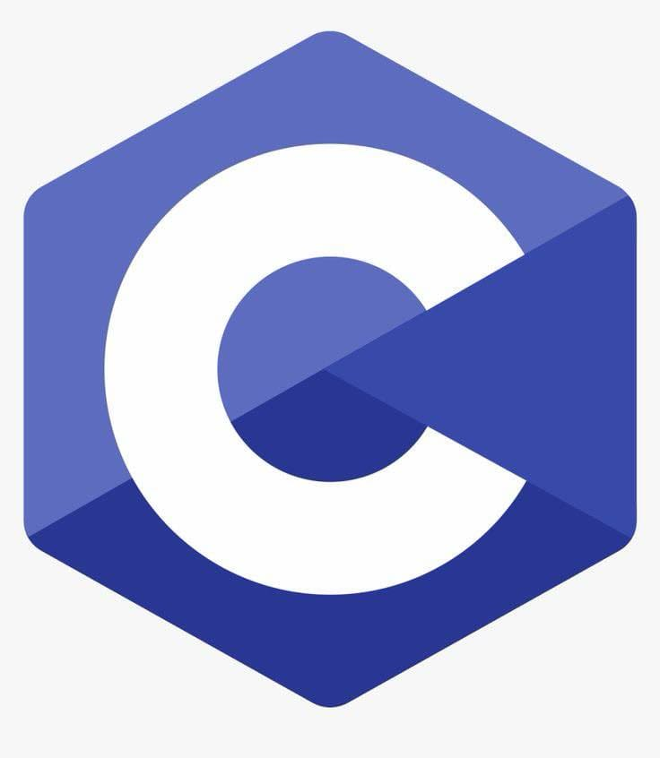

# Cấu trúc dữ liệu và Thuật toán - Ngôn ngữ C

  

  
  
  

## ⭐ HUSTack

    <strong>HUSTack</strong> - Kho lưu trữ bài tập Cấu trúc dữ liệu và Thuật toán của HUST. Đây là nơi bạn có thể tìm thấy các bài giảng, ví dụ mã nguồn và bài tập thực hành với ngôn ngữ lập trình C/C++.

